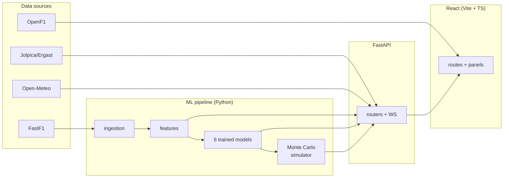

<!--
  YAML frontmatter below is required by Hugging Face Spaces — it declares
  the SDK, display metadata, and license for the deployed Space. Removing
  it will cause the Space to fail to build. The actual project README
  starts below the second `---`.
-->
---
title: Race Replay
emoji: 🏎️
colorFrom: red
colorTo: yellow
sdk: docker
app_port: 8000
pinned: false
license: mit
---

# Paddock Dashboard

> Six trained ML models, a 10,000-iteration Monte Carlo race simulator,
> and a real-time telemetry replay of every 2025–2026 Formula 1 race —
> all wired into one dashboard.

**[Open the live dashboard →](https://f1-dashboard-blush-three.vercel.app)**
&nbsp;&nbsp;·&nbsp;&nbsp;
[Architecture](docs/ARCHITECTURE.md) ·
[Design decisions](docs/DECISIONS.md) ·
[Deploy guide](DEPLOY.md)

Predicts who wins the next race, who'll stand on the podium, and where
every driver will finish. Then lets you press play and watch how the
race actually unfolded — track-map dots, timing tower, telemetry traces,
overtake feed, all replayed second-by-second from the FastF1 cache.

Built as a portfolio piece for senior ML engineers and hiring managers
who have never watched F1 before. Every jargon term has an inline
glossary tooltip; every prediction page explains what it shows; and the
whole thing runs for **$0/month** on Vercel + Hugging Face Spaces.

## Three pillars

### Predict (`/apex`)
Six trained models score every driver for the next race: top-10
probability, podium probability, winner via a Plackett-Luce ranker, DNF
probability, fastest-lap probability, and a qualifying model used when
the actual grid isn't published yet. A 10K-iteration Monte Carlo
simulator turns those scores into real probabilities (win %, podium %,
expected finishing position) with a 22×22 distribution matrix you can
expand. SHAP attributions drive the per-podium-driver prose
explanations.

### Replay (`/live`)
Every 2025–2026 race cached in the FastF1 archive plays back at
configurable speed (1× through 32×). Track-map dots animate on the
actual racing line, the FIA-style timing tower shows position / code /
team / gap / interval / tyre compound + age / pit count for every
driver, the overtake feed streams events as the playhead crosses them,
and clicking any driver opens a telemetry side-panel with speed,
throttle, brake and gear traces.

### Analyse (`/standings`, `/driver/:code`)
Round-aware drivers' and constructors' championship tables (verify
HAM = VER = 369.5 pts heading into Abu Dhabi 2021 if you want a fun
sanity check — though 2021 itself isn't loaded). A cumulative-points
progression chart. Per-driver profiles with a team-mate-controlled
performance strip — the H2H against your team-mate is the closest
thing F1 has to a controlled experiment, so each metric plots its
delta from team-mate parity rather than against the field.

## Architecture at a glance



See [docs/ARCHITECTURE.md](docs/ARCHITECTURE.md) for the full pipeline
walkthrough.

## Tech stack

**Backend** Python 3.12 · FastAPI · XGBoost · LightGBM · SHAP · FastF1 ·
Pandas · NumPy · scikit-learn · APScheduler · httpx

**Frontend** React 18 · TypeScript · Vite · TanStack Query · Tailwind v4 ·
Recharts · Framer Motion · Zustand · WebSocket

**Deploy** Vercel (frontend) · Hugging Face Spaces (backend, Docker SDK) ·
GitHub Actions (lint + tests + Lighthouse CI)

## Run it locally

Two terminals — Python backend on `:8000`, Vite dev server on `:5173`
that proxies `/api/*` requests.

```bash
# 1 — Python deps
python -m venv venv && source venv/bin/activate     # macOS/Linux
pip install -r requirements.txt

# 2 — JS deps
cd web && npm install && cd ..

# 3 — Run both
uvicorn src.api.main:app --reload --port 8000          # terminal A
cd web && npm run dev                                  # terminal B
```

Open `http://localhost:5173`.

Windows users: `scripts/dev.ps1` launches both at once.

The full data pipeline (FastF1 ingestion → cleaning → features → train)
is documented in [docs/architecture.md](docs/architecture.md). You can
skip it for local dev — the deployed backend already serves the trained
models and the parquet cache.

## Deploy

```
Frontend → Vercel (Vite, root: web/)        free Hobby plan
Backend  → Hugging Face Spaces (Docker)     free CPU basic
```

Total cost: **$0/month**. See [DEPLOY.md](DEPLOY.md) for the full
walkthrough.

## Tests + CI

```bash
pytest tests/                 # 28 backend tests
cd web && npm test -- --run   # 14 frontend tests (including axe-core a11y)
cd web && npm run lint        # ESLint flat config with strict react-hooks rules
cd web && npm run typecheck   # tsc --noEmit
cd web && npm run build       # Production bundle (~120 KB initial paint, gzipped)
```

GitHub Actions runs all of the above on every PR plus a Lighthouse CI
job with strict thresholds: Perf ≥ 90, A11y ≥ 95, Best Practices ≥ 95,
SEO ≥ 90.

## Project structure

```
src/
├── ingestion/         FastF1 + Jolpica wrappers (historical + live)
├── cleaning/          align.py — race + driver alignment
├── features/          ~18 features per race-driver row
├── models/            Six target definitions + training entrypoint
│   └── targets/       top10 · podium · winner · dnf · fastest_lap · quali
├── inference/         predict_race + Monte Carlo simulator
├── live/              session snapshot + scheduler + driver metrics
└── api/               FastAPI app + routers + WebSocket + schemas

web/src/
├── routes/            Landing · Apex · Live · Standings · Driver · Schedule · About
├── components/        ui/ primitives, panels/, RouteHeader, SectionHeader, Shell
├── hooks/             useApi, useLiveSocket, useCountUp, useDriverTelemetry
├── lib/               api, types, teams, glossary, cn
├── store/             raceContext (Zustand)
└── styles/            tokens.css (3 elevation tiers + typography ramp), globals.css

docs/                  ARCHITECTURE.md · DECISIONS.md · DEPLOY.md
.github/workflows/     test.yml (lint + pytest + vitest) · lighthouse.yml
```

## What's distinctive about this build

- **Team-mate H2H performance metrics.** A driver's qualifying score
  isn't "average grid position" — it's "% of races out-qualified
  team-mate." Same car, same strategy, same conditions. The closest
  thing F1 has to a controlled experiment.
- **Real lap-data tyre management.** Reads `data/raw/lap_data.parquet`
  and compares each driver's longest stint per compound against the
  field median for that race.
- **Solari split-flap countdowns.** Departure-board flap cards on the
  schedule page's "lights out in" countdown.
- **FIA-screen distribution matrix + standings.** Hard-edged
  character-cell layout with cream column rules and coral hover edges,
  modelled on the real FIA timing screen.
- **Pit-wall timing tower** with tyre-wear desaturation on the compound
  ring — engineers literally watch this gradient. Fresh rubber = vivid
  colour, aged rubber = faded.
- **Conformal intervals** on the winner artifact. Calibrated
  uncertainty bands rather than point predictions.

## License

MIT. See [LICENSE](LICENSE).
