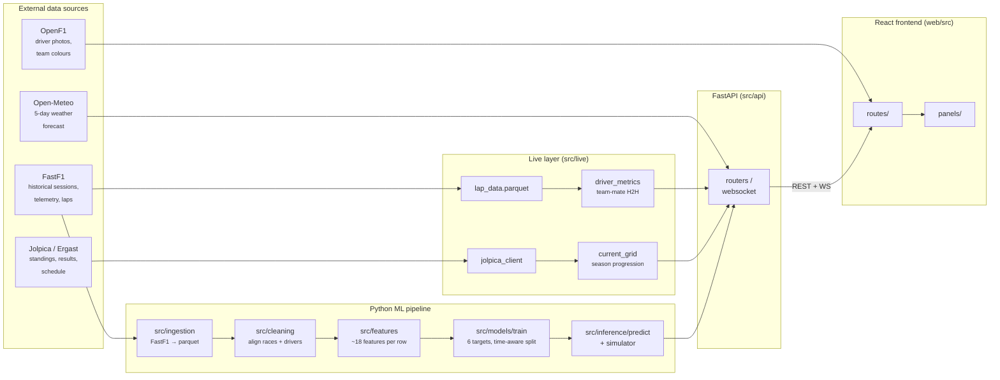

# Architecture

End-to-end walkthrough of how raw race data becomes the Paddock
Dashboard you see on `f1-dashboard-blush-three.vercel.app`. Roughly
ordered by data flow — sources on the left, browser on the right.

## Stage 1 — Ingestion (`src/ingestion/`)

`fetch_sessions.py` and `fetch_laps.py` use the
[FastF1](https://docs.fastf1.dev/) library to pull every race weekend
from 2018 onward into the local cache. FastF1 itself wraps the F1 Live
Timing API and the F1 broadcast feed, both rate-limited, so the
ingestion is `--resume`-able and uses chunked fetches. Output goes to
`data/raw/` as parquet — one file per session, per driver, per data
type (laps, weather, telemetry samples).

The big one is `lap_data.parquet` — ~196,000 rows of lap-by-lap data
(`season`, `round`, `driver_code`, `lap_number`, `compound`,
`tyre_life`, `stint`, `pit_in_time`). Read live by the performance-strip
endpoint to compute the team-mate tyre-management metric.

## Stage 2 — Cleaning (`src/cleaning/`)

`align.py` produces `data/processed/aligned_race_dataset.parquet`
(~3,500 rows: one row per driver per race). Resolves driver-code
collisions, backfills missing finish positions for non-classified
runners, deduplicates sprint vs race rows, and writes a clean `is_dnf`
flag the downstream models depend on.

## Stage 3 — Features (`src/features/`)

`build_features.py` joins the aligned dataset with rolling-window
derivations, circuit metadata, and per-team form. The output is the
training matrix the six models consume.

Four feature families, ~18 columns total:

- **Qualifying** — gap to pole (ms), grid position, intra-team delta
- **Driver form** — rolling L5/L10 avg finish, DNF rate, fastest-lap
  rate, points trajectory
- **Team / car form** — team avg finish, pit stop times, team DNF rate
- **Circuit history** — driver's avg finish at this venue, downforce
  level, overtake difficulty, wet-race rate, weather forecast

## Stage 4 — Models (`src/models/targets/`)

Six target definitions, each conforming to a `Target` dataclass so they
all share one training entrypoint (`src/models/train.py`):

| Target | Kind | Algorithm | Label |
|---|---|---|---|
| `top10` | binary | XGBClassifier | `finish_position ≤ 10` |
| `podium` | binary | XGBClassifier (boosted positive weight) | `finish_position ≤ 3` |
| `winner` | ranker | LGBMRanker (group = race) | `21 - finish_position` |
| `dnf` | binary | XGBClassifier | `is_dnf` |
| `fastest_lap` | regression | LGBMRegressor | per-race median-lap rank |
| `quali` | regression | LGBMRegressor (no quali leakage) | `quali_position` |

Trained with a **time-aware split** (2018–2024 + 2026 train, 2025
validation) — see [DECISIONS.md](DECISIONS.md) for why 2026 is in train.
SHAP attributions are computed at train-time and serialised next to the
model so the prediction endpoint can return per-feature contributions
without re-running the explainer at request time.

## Stage 5 — Inference (`src/inference/`)

`predict.py` branches on `artifact["kind"]` so all six targets share one
call path. Multi-target predictions come back in a single response.

`simulator.py` runs the Monte Carlo simulator: 10,000 race samples
where each driver's `prob_dnf` triggers a Bernoulli retirement roll,
and the finishing order of the survivors is drawn from a
**Plackett-Luce** distribution over `prob_win` (which preserves the
"top drivers finish near top" coupling that independent samples would
break). Returns the 22×22 distribution matrix, win/podium probabilities,
expected points, and the top podium combinations.

## Stage 6 — Live layer (`src/live/`)

Anything that doesn't depend on the training pipeline:

- `jolpica_client.py` — paginated wrapper around the Jolpica/Ergast
  API. Used for standings, schedule, and sprint results (the latter is
  why championship-development charts show correct totals — `/results`
  doesn't return sprint points).
- `current_grid.py` — merges race + sprint points into the season
  progression chart.
- `driver_metrics.py` — computes the performance-strip values
  (team-mate H2H % for qualifying / race pace / consistency / overtaking,
  plus lap-data-driven tyre management).

## Stage 7 — API (`src/api/`)

FastAPI app with eight router files (`apex`, `forecast`, `drivers`,
`live`, `schedule`, `standings`, `model`, `health`) and a WebSocket
stream at `/api/live/stream`. APScheduler runs in-process when
`F1ML_DISABLE_REFRESHER` isn't set — every 5 s it polls OpenF1 for live
data during race weekends and broadcasts snapshots over the WebSocket.

OpenAPI schema at `/docs`. The frontend regenerates its TypeScript
types from it via `npm run types:gen`.

## Stage 8 — Frontend (`web/src/`)

React 18 + TypeScript + Vite + Tailwind v4. State via TanStack Query
(server cache) and Zustand (race context). Routing via React Router 6
with **per-route `React.lazy()`** so the landing page first paint
ships only ~118 KB gzipped — the recharts payload (~114 KB gzipped)
loads on demand when a chart route mounts.

Design system in `web/src/styles/tokens.css`: three elevation tiers
(`recessed` / `panel` / `elevated`), typography ramp tuned for the
Playfair-display headlines + Inter body + JetBrains Mono numerics, and
spacing/radius scales. Editorial palette: coral (`#ff5e6c`) as the only
brand colour, cream (`#ede4d3`) as the editorial neutral, mint
(`#7fc9a4`) for semantic positive (up arrows, fastest lap), amber
(`#f5b800`) for semantic warning (at-risk, DNF).

## Deploy

- Frontend on **Vercel** — Hobby plan, ~100 GB bandwidth/month, preview
  deploy per PR
- Backend on **Hugging Face Spaces** — Docker SDK, CPU basic, 16 GB RAM,
  50 GB disk, sleeps after 48h idle (cold start ~25 s)

Trained model artifacts (~2.8 MB total) ship inside the Space's Docker
image so the deploy has no external storage dependency. Data parquets
(~3 GB) live in the Space's persistent disk.

## Data flow per dashboard route

| Route | Source of truth | Refresh cadence |
|---|---|---|
| `/` (Landing) | static | — |
| `/live` (Watch) | FastF1 cache + cached snapshots | per-tick during replay |
| `/calendar` (Schedule) | Jolpica + Open-Meteo + circuits.csv | 1h |
| `/apex` (Predict) | feature_matrix + 6 trained models | per-request |
| `/standings` | Jolpica + aligned_race_dataset.parquet | per-request |
| `/driver/:code` | aligned + lap_data.parquet | per-request |
| `/model` | models/trained/manifest.json | static |
| `/about` | static | — |
