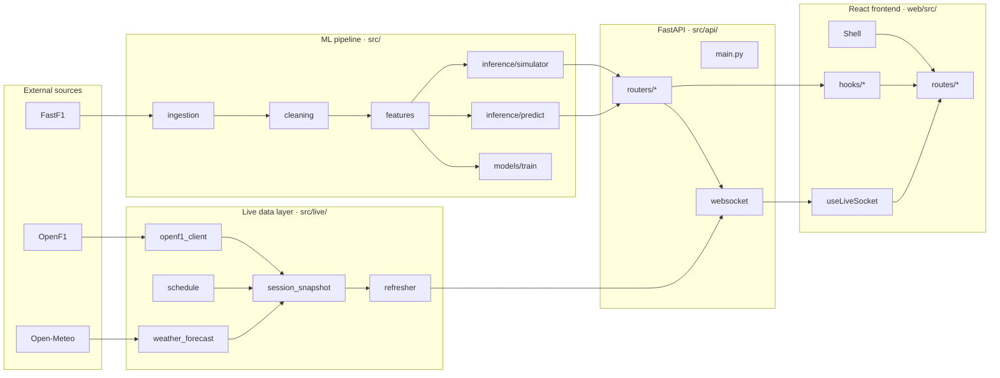

# Architecture

## Process model (development)

1. `uvicorn src.api.main:app --reload --port 8000`
   - FastAPI app starts
   - `lifespan` starts an `APScheduler` BackgroundScheduler
   - Scheduler jobs:
     - Every 5s: pull a fresh OpenF1 snapshot → `data/live/current_session.json` → broadcast over WebSocket
     - Every 1h: refresh schedule + weather caches
2. `cd web && pnpm dev` — Vite dev server on `:5173`. `/api/*` requests proxy to `:8000`.
3. The React app:
   - REST: fetches schedules, predictions, historical data via TanStack Query
   - WebSocket: subscribes to `/api/live/stream` and merges snapshots into Zustand state

## Process model (deployment)

- Frontend → **Vercel**, builds the static SPA from `web/`. Env: `VITE_API_URL`, `VITE_WS_URL`.
- Backend → **Railway**, runs `uvicorn src.api.main:app` (one worker — APScheduler must be single-process). Persistent volume holds `data/cache/`, `data/processed/`, `data/live/`, `models/trained/`.

## Data flow per dashboard tab

| Route | Source of truth | Refresh cadence |
|---|---|---|
| `/live` | OpenF1 → refresher → WebSocket | 5s push |
| `/calendar` | FastF1 schedule + Open-Meteo + circuits.csv | 1h |
| `/predict` | feature_matrix + 6 trained models | on demand |
| `/explore` | feature_matrix (parquet) | static |
| `/driver/:code` | feature_matrix | static |
| `/model` | models/trained/manifest.json | static |
