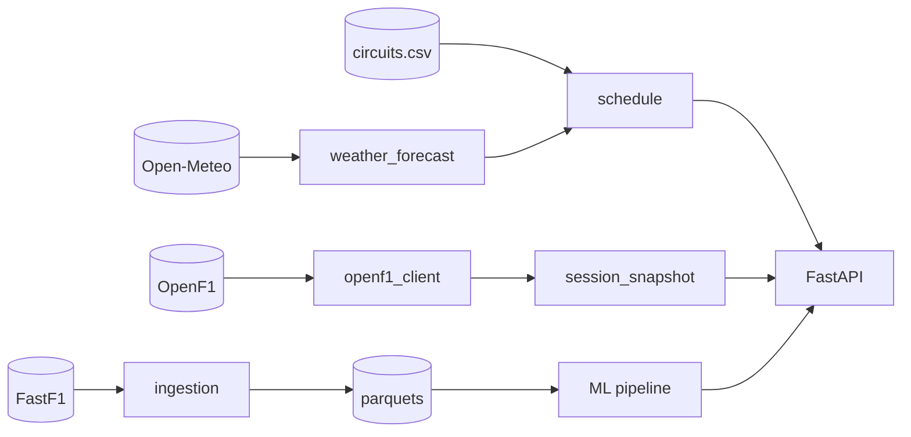

# Data sources

## FastF1

- **What:** Historical race data (results, qualifying, weather, laps, telemetry) back to 2018.
- **How we use it:** All training and feature data — `src/ingestion/fetch_sessions.py`, `src/ingestion/fetch_laps.py`.
- **Caching:** FastF1's built-in pickle cache lives in `data/cache/`. Configurable via `FASTF1_CACHE_DIR`.
- **Limits:** Rate-limited at the API level; first full season ingestion takes 30–60 minutes.
- **Offline behaviour:** Cached sessions work offline; uncached sessions raise and are skipped.

## OpenF1 — `https://api.openf1.org/v1`

- **What:** Live race data — driver positions, intervals, telemetry (~3.7Hz), pit stops, race control, weather, session metadata.
- **How we use it:** `src/live/openf1_client.py` wraps each endpoint with `httpx` + 5-second TTL cache.
- **Limits:** No published rate limit, but we cache aggressively (5s) and only poll while a session is `Active`.
- **Schema drift:** Responses occasionally add/remove fields. We Pydantic-validate where critical and degrade gracefully (`session_snapshot.py` defaults missing fields to `None`).
- **Offline behaviour:** All client calls catch `httpx.HTTPError` and return empty frames. The dashboard then surfaces an "offline / no active session" state.

## Open-Meteo — `https://api.open-meteo.com/v1`

- **What:** Free weather forecasts (no API key needed). We use 3-day hourly forecasts of temperature, precipitation, precipitation probability, wind speed, cloud cover.
- **How we use it:** `src/live/weather_forecast.py` keyed by circuit lat/lon. Used on the `/calendar` route and as a forecast input to `/predict`.
- **Limits:** Free tier allows ~10k requests/day. We cache forecasts for 1h in-memory + persist to disk.
- **Offline behaviour:** Returns the persisted JSON if present; otherwise returns an empty forecast and the UI shows "—".

## Circuit metadata — `data/schedule/circuits.csv`

- **What:** Hand-curated per-circuit attributes: lap length, corners, DRS zones, downforce level, lat/lon, overtake difficulty (1–5), typical air temperature, wet-race rate.
- **How we use it:** Joined into the schedule endpoint and into model features (track encodings).
- **Maintenance:** Update once per season when new circuits join or are removed. Rows are keyed by a `circuit_id` slug; `src/live/schedule.py:_normalize_circuit_id` maps FastF1 location names to those ids.

## Combining the sources

